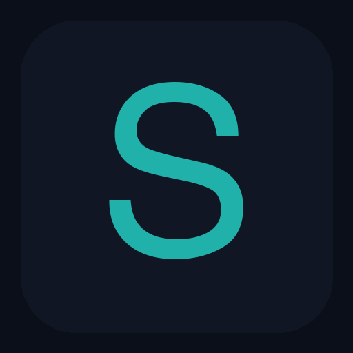
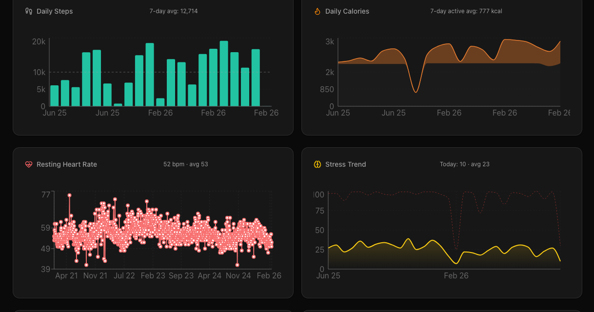
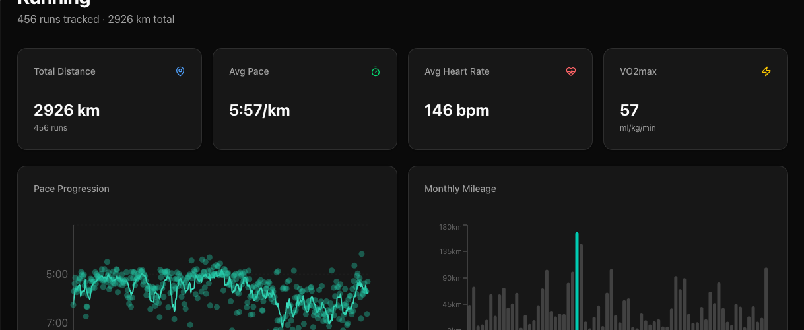
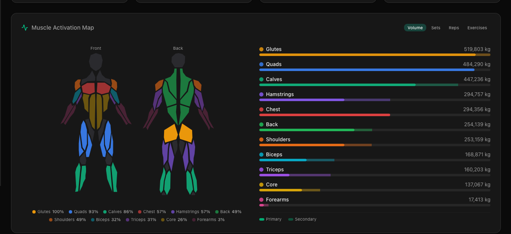
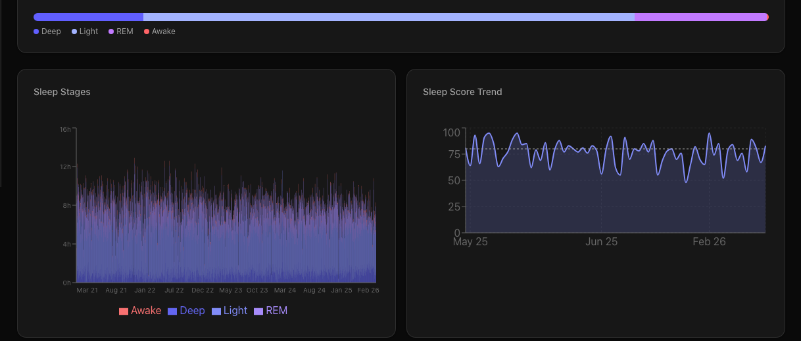
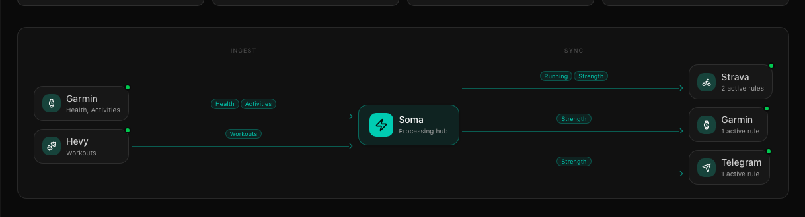

<div align="center">
  <br>
  
  <br><br>
  <h2>soma</h2>
  <p>Your health stack, finally unified.<br>
  Garmin · Hevy · Strava — one self-hosted dashboard, your data, your server.</p>
  <br>

  **[Live Demo →](https://soma-demo.gkos.dev)**

  <br>

  [](https://vercel.com/new/clone?repository-url=https%3A%2F%2Fgithub.com%2Fdrkostas%2Fsoma&root-directory=web&env=DATABASE_URL,STRAVA_CLIENT_ID,STRAVA_CLIENT_SECRET,NEXT_PUBLIC_BASE_URL&envDescription=See%20the%20setup%20guide&envLink=https%3A%2F%2Fgithub.com%2Fdrkostas%2Fsoma%23setup)

  <br>

  [](./LICENSE)
  [](https://nextjs.org)
  [](https://python.org)
  [](https://neon.tech)

  <br><br>
</div>

---

## Overview

Daily steps, resting heart rate, stress trend, body composition, recovery status, weekly training load, activity streaks — your full health picture on one page.



---

## Running

Pace progression across every run, monthly mileage history, VO2max trend, training zones, HR vs pace scatter, split analysis, shoe mileage tracking.



---

## Workouts

Muscle activation map (front & back) with volume by muscle group across all sessions. Exercise progression, personal records, gym frequency heatmap.



---

## Sleep & Recovery

Sleep stages over time (deep, light, REM, awake), score trend, sleep schedule, HRV, blood oxygen, respiration rate, body battery, training readiness.



---

## Sync Hub

See exactly what synced, configure push rules (e.g. Hevy strength → Strava), and monitor the live data pipeline.



---

## Architecture

```
Garmin Connect ──┐
                 ├──▶  sync/ (Python, hourly)  ──▶  Neon PostgreSQL  ◀──  web/ (Next.js)  ──▶  Vercel
Hevy API ────────┘                                                                │
                                                                                  ▼
                                                                             Strava (push)
```

`sync/` writes. `web/` reads. That boundary never crosses.

---

## Setup

### Prerequisites

| Service | Required | Notes |
|---|---|---|
| [Neon](https://neon.tech) | ✓ | Free tier works |
| Garmin Connect | ✓ | Any Garmin device |
| [Hevy Pro](https://hevy.com) | optional | Strength workouts |
| [Strava API app](https://www.strava.com/settings/api) | optional | Activity push |

### 1 — Database

```bash
psql "$DATABASE_URL" -f sync/schema.sql
```

### 2 — Web app

[](https://vercel.com/new/clone?repository-url=https%3A%2F%2Fgithub.com%2Fdrkostas%2Fsoma&root-directory=web&env=DATABASE_URL,STRAVA_CLIENT_ID,STRAVA_CLIENT_SECRET,NEXT_PUBLIC_BASE_URL&envDescription=See%20the%20setup%20guide&envLink=https%3A%2F%2Fgithub.com%2Fdrkostas%2Fsoma%23setup)

Set **Root Directory → `web`** in Vercel, then add:

| Variable | Value |
|---|---|
| `DATABASE_URL` | Neon connection string |
| `AUTH_SECRET` | Random 32-char string (`openssl rand -base64 32`) |
| `GITHUB_CLIENT_ID` | From your [GitHub OAuth app](https://github.com/settings/developers) |
| `GITHUB_CLIENT_SECRET` | From your GitHub OAuth app |
| `GITHUB_OWNER_USERNAME` | Your GitHub username (only this account gets access) |
| `NEXT_PUBLIC_BASE_URL` | Your Vercel URL |
| `GITHUB_PAT` | GitHub Personal Access Token with `repo:workflow` scope — needed for the **Sync Now** button |
| `STRAVA_CLIENT_ID` | From your Strava API settings *(optional)* |
| `STRAVA_CLIENT_SECRET` | From your Strava API settings *(optional)* |

**GitHub OAuth app setup:** go to [github.com/settings/developers](https://github.com/settings/developers) → New OAuth App → set **Authorization callback URL** to `https://your-app.vercel.app/api/auth/callback/github`.

Then visit `/connections` to complete Strava OAuth.

### 3 — Sync engine

<details>
<summary><strong>GitHub Actions</strong> (recommended — free, runs in the cloud)</summary>
<br>

Add to your fork under **Settings → Secrets → Actions**:

| Secret | Value |
|---|---|
| `DATABASE_URL` | Neon connection string |
| `GARMIN_EMAIL` | Garmin Connect email |
| `GARMIN_PASSWORD` | Garmin Connect password |
| `HEVY_API_KEY` | Hevy API key *(Pro required)* |
| `STRAVA_CLIENT_ID` | Strava client ID |
| `STRAVA_CLIENT_SECRET` | Strava client secret |
| `TELEGRAM_BOT_TOKEN` | *(optional)* |
| `TELEGRAM_CHAT_ID` | *(optional)* |

Runs every 4 hours via [`.github/workflows/sync.yml`](.github/workflows/sync.yml). Trigger instantly via the **Sync Now** button on the Connections page, or from the **Actions** tab.

</details>


---

## Development

```bash
cd web && npm install && npm run dev    # → http://localhost:3456
cd sync && python -m src.pipeline      # manual sync run
```

### In-app Claude chat

A floating chat bubble in the bottom-right of every soma page spawns a
local `claude -p` subprocess per turn — no API key, no extra service. It
reuses your Claude Code subscription auth from `~/.claude/`.

Requirements:

- [Claude Code CLI](https://docs.anthropic.com/en/docs/claude-code) installed and authenticated (`claude --version` should print a version).
- soma running locally (`npm run dev` above). The widget makes a subprocess call, so it can't work on Vercel deployments — local-only by design.

On the first message the route bootstraps a new session, captures its UUID,
and stores it at `~/.soma/chat.json` so subsequent turns resume the same
conversation. Click the pencil icon in the chat header to start a fresh
thread.

The assistant is primed by [`web/lib/chat-system-prompt.md`](web/lib/chat-system-prompt.md) — role, project layout, DB schemas, conventions. Edit that file to change how it behaves.

#### Using the chat from your Vercel deployment (phone / anywhere)

You can have the deployed soma forward chat requests to your Mac's local Claude
Code via a Cloudflare tunnel. Vercel becomes a thin proxy; the actual
`claude -p` still runs on your machine against your subscription auth.

**On the Mac (one-time setup):**

```bash
brew install cloudflared
cloudflared tunnel login                                    # browser auth
cloudflared tunnel create soma-chat                         # creates UUID + creds
cloudflared tunnel route dns soma-chat chat.your-domain.com # your subdomain
```

`~/.cloudflared/config.yml`:

```yaml
tunnel: soma-chat
credentials-file: /Users/<you>/.cloudflared/<UUID>.json
ingress:
  - hostname: chat.your-domain.com
    service: http://localhost:3456
  - service: http_status:404
```

Then run it (or `launchctl` it for autostart):

```bash
cloudflared tunnel run soma-chat
```

Add a shared secret to `web/.env.local`:

```
SOMA_CHAT_TOKEN=$(openssl rand -base64 32)
```

Keep `npm run dev` running on the Mac as usual.

**On Vercel** (Settings → Environment Variables):

| Var | Value |
|---|---|
| `SOMA_CHAT_TUNNEL_URL` | `https://chat.your-domain.com` |
| `SOMA_CHAT_TOKEN` | same value as the Mac's `.env.local` |

Redeploy. The widget now shows a status dot in the header:

- 🟢 green — direct local subprocess (when you're on `localhost:3456`)
- 🔵 blue — proxied via Vercel → your Mac's tunnel (when you're on the deployed URL)
- 🔴 red — tunnel unreachable (Mac asleep, no internet, etc.)

Rotate `SOMA_CHAT_TOKEN` on both sides if it ever leaks. The shared secret is
the only thing standing between your tunnel's public DNS name and your
local filesystem.

##### Self-healing autostart with launchd (macOS)

If you don't have a domain in CF DNS yet, you can still get a robust setup
using a Cloudflare Quick Tunnel + three `launchctl` agents that survive Mac
sleep, reboot, and tunnel URL rotation. The third agent watches for URL
changes and auto-syncs them to your Vercel env, so the trycloudflare URL
flap no longer breaks the deployed chat.

Three plists under `~/Library/LaunchAgents/` (per-user, no sudo):

| Plist | Purpose |
|---|---|
| `dev.gkos.soma.web.plist` | Runs `npm run dev` from `web/`, KeepAlive on crash |
| `dev.gkos.soma.tunnel.plist` | Runs `cloudflared tunnel --protocol http2 --url http://localhost:3456`, KeepAlive |
| `dev.gkos.soma.tunnel-watch.plist` | Runs [`web/scripts/soma-tunnel-watch.sh`](web/scripts/soma-tunnel-watch.sh) which tails the tunnel log, detects URL rotation, runs `vercel env rm/add SOMA_CHAT_TUNNEL_URL production` + `vercel deploy --prod` |

After writing the plists, load them with `launchctl bootstrap gui/$UID <plist>`.
Logs land in `~/Library/Logs/soma/`. To temporarily disable for hands-on
development: `launchctl bootout gui/$UID dev.gkos.soma.web`.

Prereqs for autosync: the Vercel CLI must be logged in (`vercel login`)
once on the Mac so the watcher's `vercel env`/`vercel deploy` calls work
non-interactively.

---

## License

[MIT](./LICENSE)

---

<div align="center">
  <sub>Built for athletes who want to understand their data, not just collect it.</sub>
</div>
